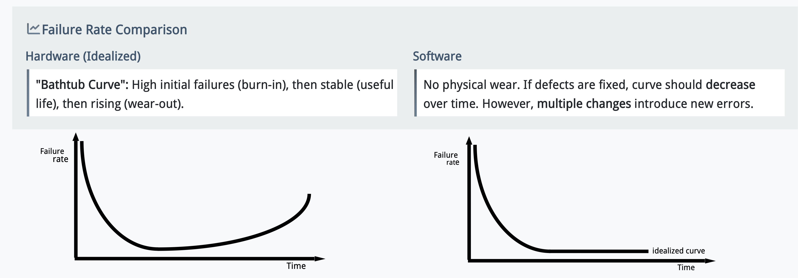
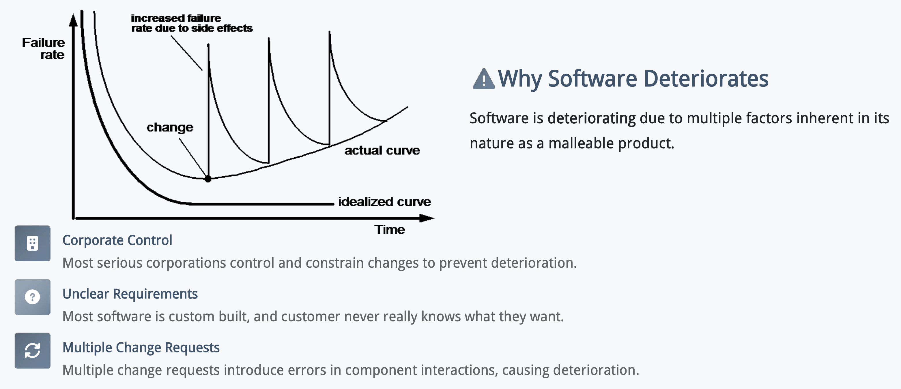
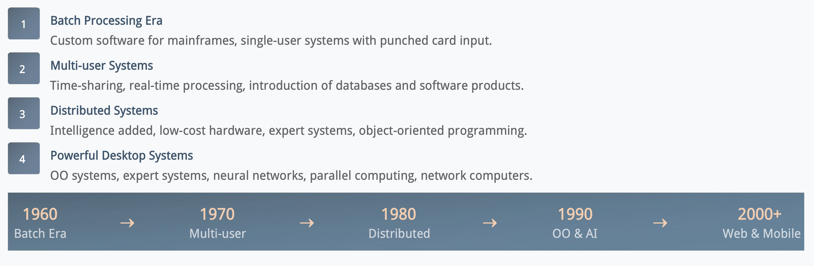
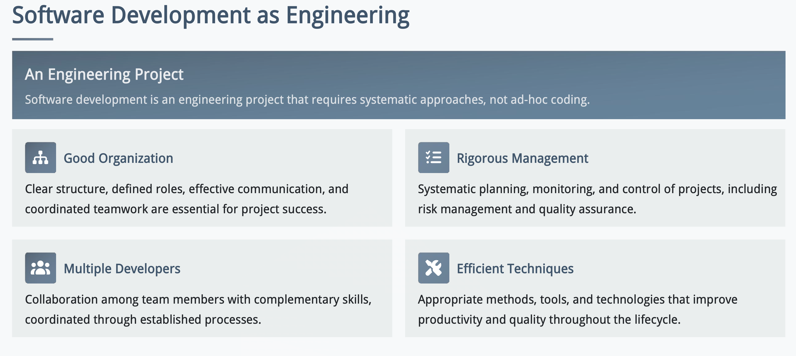

# 软件与软件工程

## 什么是软件

软件是：

- **computer programs** that provide desired features when executed.
- **data structures** that enable programs to adequately manipulate information
- **descriptive information** that describes the operation and the use of programs

软件同时扮演两种角色：

- 产品本身 (product)
  - 比如 QQ，微信等等产品
- 产生生产的载体 (vehicle for delivering products)
  - 比如操作系统，编译器，集成开发环境等等

软件和硬件对比：

- 软件和硬件最显著的区别是软件不会磨损 (wear out)

> 图中两条曲线一开始都高，但**原因不同**：
>
> - **硬件：早期故障（infant mortality）**。刚投入使用时，少数器件可能存在制造、装配或材料缺陷，容易很快坏掉。经过运行筛选和更换后，留下的器件较稳定，所以故障率下降。
> - **软件：早期缺陷被发现**。新软件可能还有测试未覆盖的错误；正式使用后，用户遇到更多输入和场景，这些错误便暴露出来。开发者修复缺陷后，故障率通常下降。

软件不会折旧但是反复的修改会让其退化：

- **下方的 idealized curve（理想曲线）**：新软件中的缺陷逐渐被修复，故障率下降，然后保持较低水平。

- **标着 change 的点**：系统进行了一次修改，例如增加借书规则。

- **每次向上冲的尖峰**：修改可能带来新的错误，尤其是模块之间相互影响产生的 *side effects（副作用）*。发现并修复错误后，故障率又下降。

- **actual curve（实际曲线）逐渐抬高**：如果不断增加功能，却没有整理设计、充分测试，系统越来越复杂，后续修改也越来越容易出问题。

### 什么是好软件

从 3 个角度判断一个软件是否是好软件：

| 角度                                        | 关注的问题                                   | 以图书馆系统为例                                   |
| ------------------------------------------- | -------------------------------------------- | -------------------------------------------------- |
| **Product quality（产品质量）**             | 软件本身好不好用、靠不可靠？                 | 搜索结果是否正确，借书记录会不会丢失，操作是否方便 |
| **Process quality（过程质量）**             | 开发和维护的过程能否稳定地发现、预防问题？   | 需求有没有核对，设计有没有评审，修改后有没有测试   |
| **Quality in business context（业务价值）** | 软件是否解决了值得解决的问题，投入是否合理？ | 它是否真正节省馆员时间，建设和维护成本是否值得     |

**三者不能互相代替。** 一个系统可能代码写得很好，却没有解决用户真正的问题；也可能目前能用，但缺少测试和文档，下一次修改就很容易出错。

## 软件更新

### 遗留软件 (Legacy Software)

**Legacy software（遗留软件）**是已经使用较长时间、仍支撑重要业务，但修改和维护往往比较困难的软件。

- **Longevity**：运行了很多年

- **Business criticality**：业务依赖它，不能随意停用或替换

- **Poor quality**：常见问题是设计难扩展、代码难懂、文档和测试记录缺失、历次修改没有管理好

### 为什么软件要更新

原因：

- Adapt to new computing environments or technology 
- Enhance to implement new business requirements
- Extend to make it interoperable with modern systems 
- Re-architect to make it viable within a network environment

### 软件发展阶段

## 软件危机

### 什么是软件危机

软件危机指的是人类反复遇到的开发困难。

> 软件危机具体表现为：项目交付延期、项目开发超预算、项目效果效率低、项目缺陷多、不满足用户需求、系统难以维护。

### 造成软件危机的原因

- **Rolling baseline（不断移动的需求基线）**：开发还在进行，目标却不断变化。比如图书馆系统原本只需借还书，做到一半又要求预约、跨馆借阅、罚款支付；如果没有重新评估工作量，原计划就失效了。
- **Complexity（复杂性）**：功能和模块增多后，没人能轻易理解整个系统。修改一处可能影响别处；老系统的原开发者离开后，理解成本更高。
- **Risk management failure（风险管理失败）**：技术难点或需求分歧没有尽早验证，直到项目后期才发现“做出来的东西不对”或“关键功能实现不了”。

### 解决方法：Software Engineering

把开发作为**工程项目**来组织：明确职责和沟通方式，规划并跟踪进度，管理风险与质量，使用合适的方法和工具。

### 为什么有了方法仍会遇到问题

| 问题                         | 具体表现                                                 |
| ---------------------------- | -------------------------------------------------------- |
| **需求问题**                 | 真正的用户没有参与；需求含糊；所有功能都被说成“最重要”   |
| **Scope creep（范围蔓延）**  | 功能不断增加，但时间和资源没有相应调整                   |
| **Technical debt（技术债）** | 为赶进度采用临时方案，后来需要花更多成本修改、测试和维护 |

例如，客户签字确认了需求文档，却在试用时发现流程不符合实际工作。这说明“按文档做完”和“解决用户问题”可能是两回事，因此需要持续核对需求、评估变更。
