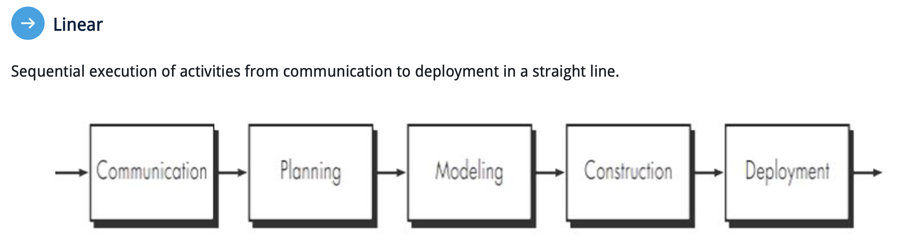
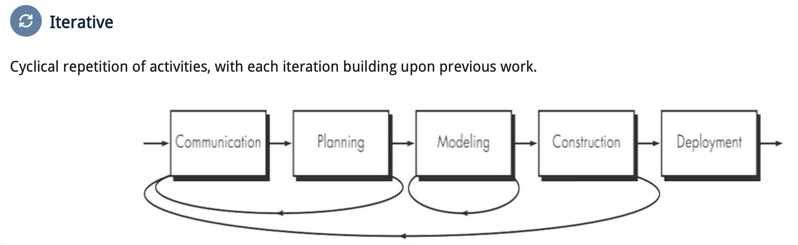
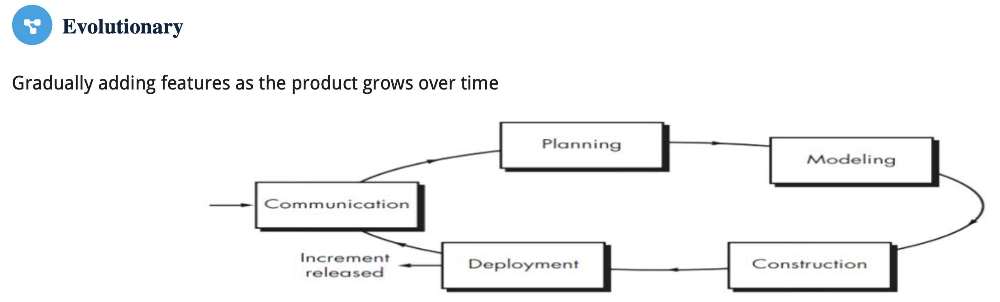
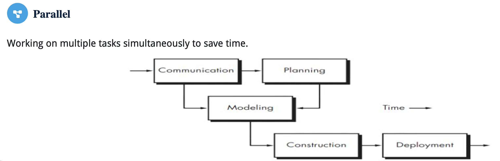
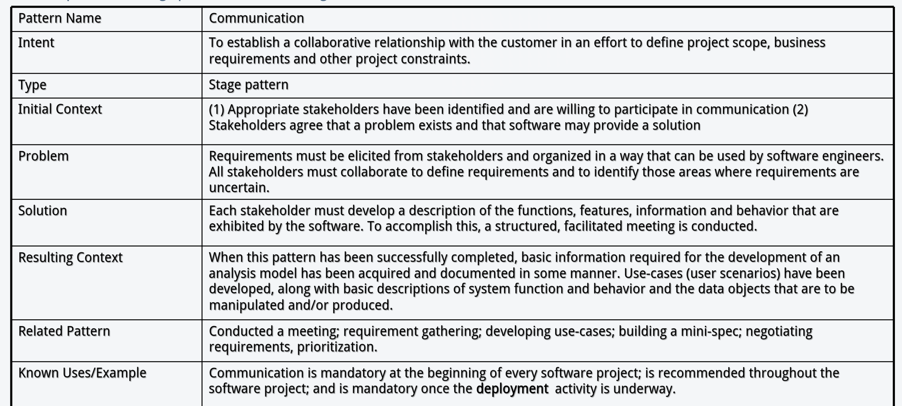

# Software Process

## Software Engineering

Software Engineering is the application of a systematic, disciplined, quantifiable approach to the development, operation, and maintenance of software.

### 软件工程的四层结构

**质量关注 → 过程 → 方法 → 工具**

- **质量关注**是基础：团队始终要考虑交付的软件是否满足需求、能否可靠运行。
- **过程（process）**规定要开展哪些活动、如何安排和检查工作。
- **方法（methods）**回答具体“怎么做”，例如需求分析、设计建模、编码和测试的方法。
- **工具（tools）**辅助执行，例如版本控制、测试框架和项目管理工具。

可以把它理解为：过程安排工作，方法指导做法，工具提供支持；质量要求贯穿其中。

## 主要框架活动

1. communication
2. planning
3. modeling
4. construction
5. deployment

### 过程流

| 页码                       | 方式                       | 图在表达什么                                                 |
| -------------------------- | -------------------------- | ------------------------------------------------------------ |
| **Linear（线性）**         | 主要按顺序推进             | 先弄清需求，再设计、开发、交付。里程碑清楚；如果后期才发现需求理解错了，返工会较大。 |
| **Iterative（迭代）**      | 做完一部分后返回前面的活动 | 测试或反馈发现问题，可以重新沟通、调整计划或设计；下一轮建立在上一轮的结果上。 |
| **Evolutionary（演化式）** | 反复开发、逐步形成产品     | 每轮可以交付一个可用的增量，产品随反馈逐渐增加功能。         |
| **Parallel（并行）**       | 部分工作同时进行           | 例如一组人完善需求，另一组人开始设计已明确的部分；能缩短时间，但需要协调依赖和接口。 |

## 普适性活动 (umbrella activities)

除了“沟通、计划、建模、构建、部署”这五项主要开发活动，团队还要做一些**贯穿项目始终**的管理和检查工作。它们像一把伞，覆盖开发的各个阶段。

可以按用途理解：

| 活动             | 简单说是在做什么                            |
| ---------------- | ------------------------------------------- |
| **项目管理**     | 安排任务、跟踪进度和资源                    |
| **技术评审**     | 请人检查需求、设计或代码，尽早发现问题      |
| **质量保证**     | 检查开发过程和成果是否达到质量要求          |
| **配置管理**     | 管理文件版本与变更，例如用 Git 记录代码修改 |
| **工作成果准备** | 编写和维护需求文档、设计图、测试记录等      |
| **复用管理**     | 判断现有组件或方案能否复用                  |
| **度量**         | 收集数据，例如缺陷数、测试结果和进度        |
| **风险管理**     | 提前识别、评估并处理可能影响项目的风险      |

举个例子：开发图书馆系统时，团队正在**构建**借书功能；与此同时，还要用 Git 管理版本、评审代码、运行测试、跟踪进度。这些同时进行的工作就是普适性活动。

**最关键的区别：**

- 五项框架活动描述软件开发的主要工作

- 普适性活动负责在整个过程中持续管理、检查和改进这些工作

## 过程模式 (Process Pattern)

把项目中反复遇到的问题，以及在特定情况下有效的处理办法，整理成一份**以后可以参考的经验方案**。

> 团队经常遇到“客户说不清需求”的问题，就可以记录一种需求沟通模式：
>
> > **适用情况**：涉及多类用户，需求还不明确。
> > **问题**：不同用户的说法有冲突。
> > **做法**：分别访谈，整理使用场景，再组织讨论确认。
> > **结果**：得到一份已确认的需求清单，并标出仍有争议的部分

process pattern template:

1. pattern name: Descriptive name that captures the essence of the pattern
2. intent: The goal or objective this pattern aims to achieve
3. type: Classification as Task Pattern, Stage Pattern, or Phase Pattern
4. initial context: Conditions and prerequisites that must be satisfied before applying this pattern
5. problem: The specific challenge or set of challenges this pattern addresses
6. solution
7. resulting context
8. additional elements (related patterns / exmaples)

 ## Sofeware Process Assessment

团队可以检查自己的开发方式：项目是否有计划、变更是否受控、问题能否尽早发现。评估的目的，是找出薄弱环节，再决定先改进什么。

### CMM

**CMM（Capability Maturity Model）**用五级描述组织的软件开发过程有多成熟：

| 级别 | 名称                   | 通俗理解                                       |
| ---- | ---------------------- | ---------------------------------------------- |
| 1    | Initial（初始级）      | 主要靠个人能力和临场发挥，结果难预测。         |
| 2    | Repeatable（可重复级） | 项目开始有计划、需求管理、进度跟踪和版本管理。 |
| 3    | Defined（已定义级）    | 组织形成统一的过程，各项目在此基础上开展工作。 |
| 4    | Managed（已管理级）    | 用定量数据管理过程和质量。                     |
| 5    | Optimized（优化级）    | 持续预防缺陷、分析问题并改进过程。             |

### CMMI

**CMMI（Capability Maturity Model Integration）**是在更广范围内整合过程改进实践的框架，也用五级表示成熟度：

**Initial → Managed → Defined → Quantitatively Managed → Optimizing**

这里最容易与 CMM 混淆的是名称：

- **CMM 第 2 级叫 Repeatable，第 4 级叫 Managed。**
- **CMMI 第 2 级叫 Managed，第 4 级叫 Quantitatively Managed。**

理解差别时，抓住 **第 2 级与第 3 级**：第 2 级侧重“各项目能够计划和管理自己的工作”；第 3 级则进一步形成“组织范围内可使用、可调整的标准过程”。第 4 级再用数据分析和控制过程表现。

